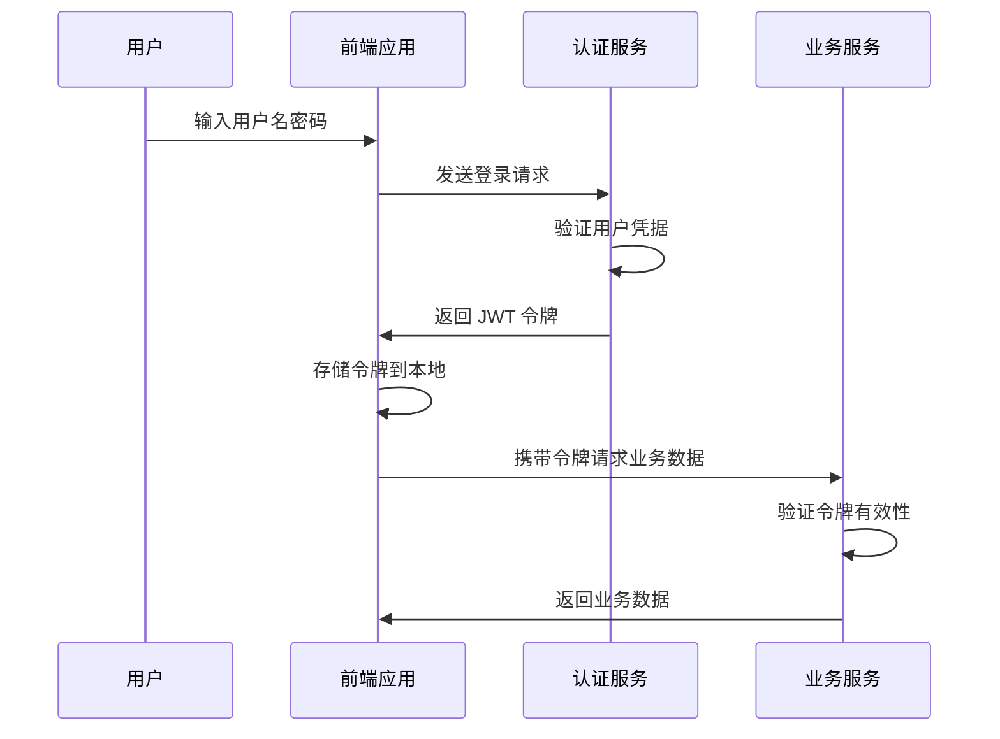

# 第五章：用户认证系统实现

"信任是一切关系的基础，包括用户与应用之间的关系。"

还记得互联网早期的时代吗？那时候的网站大多是静态页面，用户身份的概念还很模糊。而现在，用户认证已经成为了几乎所有 Web 应用的核心功能。从简单的用户名密码，到 OAuth、JWT、多因素认证，认证系统的复杂度在不断提升，但其核心目标始终不变：确保正确的人能够访问正确的资源。

在我们的 LMS 系统中，用户认证不仅仅是一个技术问题，更是用户体验的关键环节。一个好的认证系统应该是安全的、便捷的、可扩展的。它应该让用户感到安全，而不是被繁琐的流程所困扰。

今天，我们就来一步步构建这样一个认证系统，从前端的表单设计到后端的 API 集成，从状态管理到权限控制，让我们的 LMS 系统真正"认识"每一个用户。

## 🎯 本章目标

- 理解现代 Web 应用的认证机制
- 实现完整的登录注册流程
- 掌握 JWT 令牌的使用和管理
- 学会设计用户状态管理系统
- 了解权限控制和路由守卫的实现

## 🔐 认证系统架构设计

### 认证流程概览

在深入代码之前，让我们先理解整个认证流程：



### 技术选型

对于我们的认证系统，我们选择了以下技术栈：

- **JWT (JSON Web Token)**: 无状态的令牌认证
- **Pinia**: Vue 3 的状态管理库
- **VueUse**: 实用的组合式函数库
- **Zod**: 类型安全的数据验证

## 🏗️ 认证状态管理

### 创建认证 Store

首先，让我们创建一个 Pinia store 来管理用户认证状态：

```typescript
// composables/useAuth.ts
import { defineStore } from 'pinia'
import type { User, LoginCredentials, RegisterData } from '~/types/auth'

interface AuthState {
  user: User | null
  token: string | null
  isLoading: boolean
  error: string | null
}

export const useAuthStore = defineStore('auth', {
  state: (): AuthState => ({
    user: null,
    token: null,
    isLoading: false,
    error: null
  }),

  getters: {
    isAuthenticated: (state) => !!state.token && !!state.user,
    userRole: (state) => state.user?.role || 'guest',
    hasPermission: (state) => (permission: string) => {
      return state.user?.permissions?.includes(permission) || false
    }
  },

  actions: {
    async login(credentials: LoginCredentials) {
      this.isLoading = true
      this.error = null

      try {
        const { data } = await $fetch<{ user: User; token: string }>('/api/auth/login', {
          method: 'POST',
          body: credentials
        })

        this.user = data.user
        this.token = data.token

        // 存储到本地存储
        const tokenStorage = useStorage('auth-token', '')
        tokenStorage.value = data.token

        // 设置默认请求头
        $fetch.defaults.headers = {
          ...($fetch.defaults.headers || {}),
          Authorization: `Bearer ${data.token}`
        }

        return { success: true }
      } catch (error: any) {
        this.error = error.data?.message || '登录失败'
        return { success: false, error: this.error }
      } finally {
        this.isLoading = false
      }
    },

    async register(userData: RegisterData) {
      this.isLoading = true
      this.error = null

      try {
        const { data } = await $fetch<{ user: User; token: string }>('/api/auth/register', {
          method: 'POST',
          body: userData
        })

        this.user = data.user
        this.token = data.token

        // 存储到本地存储
        const tokenStorage = useStorage('auth-token', '')
        tokenStorage.value = data.token

        return { success: true }
      } catch (error: any) {
        this.error = error.data?.message || '注册失败'
        return { success: false, error: this.error }
      } finally {
        this.isLoading = false
      }
    },

    async logout() {
      try {
        await $fetch('/api/auth/logout', {
          method: 'POST'
        })
      } catch (error) {
        console.warn('退出登录请求失败:', error)
      }

      // 清除本地状态
      this.user = null
      this.token = null

      // 清除本地存储
      const tokenStorage = useStorage('auth-token', '')
      tokenStorage.value = ''

      // 清除请求头
      delete $fetch.defaults.headers?.Authorization

      // 重定向到登录页
      await navigateTo('/auth/login')
    },

    async refreshToken() {
      try {
        const { data } = await $fetch<{ token: string }>('/api/auth/refresh', {
          method: 'POST'
        })

        this.token = data.token

        // 更新本地存储
        const tokenStorage = useStorage('auth-token', '')
        tokenStorage.value = data.token

        return true
      } catch (error) {
        console.error('刷新令牌失败:', error)
        await this.logout()
        return false
      }
    },

    async fetchUser() {
      if (!this.token) return

      try {
        const { data } = await $fetch<{ user: User }>('/api/auth/me')
        this.user = data.user
      } catch (error) {
        console.error('获取用户信息失败:', error)
        await this.logout()
      }
    },

    async initialize() {
      // 从本地存储恢复令牌
      const tokenStorage = useStorage('auth-token', '')
      const token = tokenStorage.value

      if (token) {
        this.token = token
        $fetch.defaults.headers = {
          ...($fetch.defaults.headers || {}),
          Authorization: `Bearer ${token}`
        }

        // 获取用户信息
        await this.fetchUser()
      }
    }
  }
})

// 导出便捷的组合式函数
export const useAuth = () => {
  const store = useAuthStore()
  
  return {
    // 状态
    user: readonly(toRef(store, 'user')),
    isAuthenticated: computed(() => store.isAuthenticated),
    isLoading: readonly(toRef(store, 'isLoading')),
    error: readonly(toRef(store, 'error')),
    
    // 方法
    login: store.login,
    register: store.register,
    logout: store.logout,
    initialize: store.initialize,
    hasPermission: store.hasPermission
  }
}
```

### 类型定义

```typescript
// types/auth.ts
export interface User {
  id: string
  email: string
  name: string
  avatar?: string
  role: 'student' | 'instructor' | 'admin'
  permissions: string[]
  createdAt: string
  updatedAt: string
}

export interface LoginCredentials {
  email: string
  password: string
  remember?: boolean
}

export interface RegisterData {
  name: string
  email: string
  password: string
  confirmPassword: string
  agreeToTerms: boolean
}

export interface AuthResponse {
  user: User
  token: string
  refreshToken?: string
}
```

## 📝 登录表单实现

让我们来看看登录页面的实现：

```vue
<!-- pages/auth/login.vue -->
<template>
  <div class="space-y-6">
    <div class="space-y-2 text-center">
      <h1 class="text-2xl font-bold">欢迎回来</h1>
      <p class="text-muted-foreground">
        输入您的邮箱和密码来登录您的账户
      </p>
    </div>

    <form @submit.prevent="handleSubmit" class="space-y-4">
      <!-- 邮箱输入 -->
      <div class="space-y-2">
        <Label for="email">邮箱</Label>
        <Input
          id="email"
          v-model="form.email"
          type="email"
          placeholder="请输入您的邮箱"
          :class="{ 'border-destructive': errors.email }"
          required
        />
        <span v-if="errors.email" class="text-sm text-destructive">
          {{ errors.email }}
        </span>
      </div>

      <!-- 密码输入 -->
      <div class="space-y-2">
        <div class="flex items-center justify-between">
          <Label for="password">密码</Label>
          <NuxtLink
            to="/auth/forgot-password"
            class="text-sm text-primary hover:underline"
          >
            忘记密码？
          </NuxtLink>
        </div>
        <div class="relative">
          <Input
            id="password"
            v-model="form.password"
            :type="showPassword ? 'text' : 'password'"
            placeholder="请输入您的密码"
            :class="{ 'border-destructive': errors.password }"
            required
          />
          <Button
            type="button"
            variant="ghost"
            size="icon"
            class="absolute right-0 top-0 h-full px-3 py-2 hover:bg-transparent"
            @click="showPassword = !showPassword"
          >
            <Eye v-if="!showPassword" class="h-4 w-4" />
            <EyeOff v-else class="h-4 w-4" />
          </Button>
        </div>
        <span v-if="errors.password" class="text-sm text-destructive">
          {{ errors.password }}
        </span>
      </div>

      <!-- 记住我 -->
      <div class="flex items-center space-x-2">
        <Checkbox id="remember" v-model:checked="form.remember" />
        <Label
          for="remember"
          class="text-sm font-medium leading-none peer-disabled:cursor-not-allowed peer-disabled:opacity-70"
        >
          记住我
        </Label>
      </div>

      <!-- 错误信息 -->
      <div v-if="authError" class="p-3 rounded-md bg-destructive/10 border border-destructive/20">
        <div class="flex items-center gap-2">
          <AlertCircle class="h-4 w-4 text-destructive" />
          <span class="text-sm text-destructive">{{ authError }}</span>
        </div>
      </div>

      <!-- 提交按钮 -->
      <Button type="submit" class="w-full" :disabled="isLoading">
        <Loader2 v-if="isLoading" class="mr-2 h-4 w-4 animate-spin" />
        登录
      </Button>
    </form>

    <!-- 社交登录 -->
    <div class="relative">
      <div class="absolute inset-0 flex items-center">
        <span class="w-full border-t" />
      </div>
      <div class="relative flex justify-center text-xs uppercase">
        <span class="bg-background px-2 text-muted-foreground">或者</span>
      </div>
    </div>

    <div class="grid grid-cols-2 gap-4">
      <Button variant="outline" @click="loginWithProvider('github')">
        <Github class="mr-2 h-4 w-4" />
        GitHub
      </Button>
      <Button variant="outline" @click="loginWithProvider('google')">
        <svg class="mr-2 h-4 w-4" viewBox="0 0 24 24">
          <path fill="currentColor" d="M22.56 12.25c0-.78-.07-1.53-.2-2.25H12v4.26h5.92c-.26 1.37-1.04 2.53-2.21 3.31v2.77h3.57c2.08-1.92 3.28-4.74 3.28-8.09z"/>
          <path fill="currentColor" d="M12 23c2.97 0 5.46-.98 7.28-2.66l-3.57-2.77c-.98.66-2.23 1.06-3.71 1.06-2.86 0-5.29-1.93-6.16-4.53H2.18v2.84C3.99 20.53 7.7 23 12 23z"/>
          <path fill="currentColor" d="M5.84 14.09c-.22-.66-.35-1.36-.35-2.09s.13-1.43.35-2.09V7.07H2.18C1.43 8.55 1 10.22 1 12s.43 3.45 1.18 4.93l2.85-2.22.81-.62z"/>
          <path fill="currentColor" d="M12 5.38c1.62 0 3.06.56 4.21 1.64l3.15-3.15C17.45 2.09 14.97 1 12 1 7.7 1 3.99 3.47 2.18 7.07l3.66 2.84c.87-2.6 3.3-4.53 6.16-4.53z"/>
        </svg>
        Google
      </Button>
    </div>

    <!-- 注册链接 -->
    <div class="text-center text-sm">
      还没有账户？
      <NuxtLink to="/auth/register" class="text-primary hover:underline">
        立即注册
      </NuxtLink>
    </div>
  </div>
</template>

<script setup lang="ts">
import { Eye, EyeOff, AlertCircle, Loader2, Github } from 'lucide-vue-next'
import { Button } from '@/components/ui/button'
import { Input } from '@/components/ui/input'
import { Label } from '@/components/ui/label'
import { Checkbox } from '@/components/ui/checkbox'
import { useAuth } from '~/composables/useAuth'
import { z } from 'zod'

// 页面元数据
definePageMeta({
  title: '登录',
  layout: 'auth'
})

// 表单验证 schema
const loginSchema = z.object({
  email: z.string().email('请输入有效的邮箱地址'),
  password: z.string().min(6, '密码至少需要6个字符'),
  remember: z.boolean().optional()
})

// 响应式数据
const showPassword = ref(false)
const form = reactive({
  email: '',
  password: '',
  remember: false
})

const errors = reactive({
  email: '',
  password: ''
})

// 认证相关
const { login, isLoading, error: authError } = useAuth()

// 表单提交处理
async function handleSubmit() {
  // 清除之前的错误
  errors.email = ''
  errors.password = ''

  // 验证表单
  try {
    loginSchema.parse(form)
  } catch (error) {
    if (error instanceof z.ZodError) {
      error.errors.forEach((err) => {
        if (err.path[0] === 'email') {
          errors.email = err.message
        } else if (err.path[0] === 'password') {
          errors.password = err.message
        }
      })
      return
    }
  }

  // 提交登录
  const result = await login({
    email: form.email,
    password: form.password,
    remember: form.remember
  })

  if (result.success) {
    // 登录成功，重定向到首页或之前的页面
    const redirect = useRoute().query.redirect as string
    await navigateTo(redirect || '/')
  }
}

// 社交登录
async function loginWithProvider(provider: 'github' | 'google') {
  // 重定向到 OAuth 提供商
  window.location.href = `/api/auth/oauth/${provider}`
}

// 页面加载时检查是否已登录
const { isAuthenticated } = useAuth()
if (isAuthenticated.value) {
  await navigateTo('/')
}
</script>
```

## 📋 注册表单实现

注册表单相对更复杂，需要更多的验证：

```vue
<!-- pages/auth/register.vue -->
<template>
  <div class="space-y-6">
    <div class="space-y-2 text-center">
      <h1 class="text-2xl font-bold">创建账户</h1>
      <p class="text-muted-foreground">
        填写下面的信息来创建您的账户
      </p>
    </div>

    <form @submit.prevent="handleSubmit" class="space-y-4">
      <!-- 姓名输入 -->
      <div class="space-y-2">
        <Label for="name">姓名</Label>
        <Input
          id="name"
          v-model="form.name"
          type="text"
          placeholder="请输入您的姓名"
          :class="{ 'border-destructive': errors.name }"
          required
        />
        <span v-if="errors.name" class="text-sm text-destructive">
          {{ errors.name }}
        </span>
      </div>

      <!-- 邮箱输入 -->
      <div class="space-y-2">
        <Label for="email">邮箱</Label>
        <Input
          id="email"
          v-model="form.email"
          type="email"
          placeholder="请输入您的邮箱"
          :class="{ 'border-destructive': errors.email }"
          required
        />
        <span v-if="errors.email" class="text-sm text-destructive">
          {{ errors.email }}
        </span>
      </div>

      <!-- 密码输入 -->
      <div class="space-y-2">
        <Label for="password">密码</Label>
        <div class="relative">
          <Input
            id="password"
            v-model="form.password"
            :type="showPassword ? 'text' : 'password'"
            placeholder="请输入密码"
            :class="{ 'border-destructive': errors.password }"
            required
          />
          <Button
            type="button"
            variant="ghost"
            size="icon"
            class="absolute right-0 top-0 h-full px-3 py-2 hover:bg-transparent"
            @click="showPassword = !showPassword"
          >
            <Eye v-if="!showPassword" class="h-4 w-4" />
            <EyeOff v-else class="h-4 w-4" />
          </Button>
        </div>
        
        <!-- 密码强度指示器 -->
        <div class="space-y-1">
          <div class="flex gap-1">
            <div
              v-for="i in 4"
              :key="i"
              class="h-1 flex-1 rounded-full"
              :class="getPasswordStrengthColor(i)"
            />
          </div>
          <p class="text-xs text-muted-foreground">
            {{ passwordStrengthText }}
          </p>
        </div>
        
        <span v-if="errors.password" class="text-sm text-destructive">
          {{ errors.password }}
        </span>
      </div>

      <!-- 确认密码 -->
      <div class="space-y-2">
        <Label for="confirmPassword">确认密码</Label>
        <div class="relative">
          <Input
            id="confirmPassword"
            v-model="form.confirmPassword"
            :type="showConfirmPassword ? 'text' : 'password'"
            placeholder="请再次输入密码"
            :class="{ 'border-destructive': errors.confirmPassword }"
            required
          />
          <Button
            type="button"
            variant="ghost"
            size="icon"
            class="absolute right-0 top-0 h-full px-3 py-2 hover:bg-transparent"
            @click="showConfirmPassword = !showConfirmPassword"
          >
            <Eye v-if="!showConfirmPassword" class="h-4 w-4" />
            <EyeOff v-else class="h-4 w-4" />
          </Button>
        </div>
        <span v-if="errors.confirmPassword" class="text-sm text-destructive">
          {{ errors.confirmPassword }}
        </span>
      </div>

      <!-- 服务条款 -->
      <div class="flex items-start space-x-2">
        <Checkbox
          id="agreeToTerms"
          v-model:checked="form.agreeToTerms"
          :class="{ 'border-destructive': errors.agreeToTerms }"
        />
        <div class="grid gap-1.5 leading-none">
          <Label
            for="agreeToTerms"
            class="text-sm font-medium leading-none peer-disabled:cursor-not-allowed peer-disabled:opacity-70"
          >
            我同意
            <NuxtLink to="/terms" class="text-primary hover:underline">
              服务条款
            </NuxtLink>
            和
            <NuxtLink to="/privacy" class="text-primary hover:underline">
              隐私政策
            </NuxtLink>
          </Label>
          <span v-if="errors.agreeToTerms" class="text-sm text-destructive">
            {{ errors.agreeToTerms }}
          </span>
        </div>
      </div>

      <!-- 错误信息 -->
      <div v-if="authError" class="p-3 rounded-md bg-destructive/10 border border-destructive/20">
        <div class="flex items-center gap-2">
          <AlertCircle class="h-4 w-4 text-destructive" />
          <span class="text-sm text-destructive">{{ authError }}</span>
        </div>
      </div>

      <!-- 提交按钮 -->
      <Button type="submit" class="w-full" :disabled="isLoading">
        <Loader2 v-if="isLoading" class="mr-2 h-4 w-4 animate-spin" />
        创建账户
      </Button>
    </form>

    <!-- 登录链接 -->
    <div class="text-center text-sm">
      已经有账户了？
      <NuxtLink to="/auth/login" class="text-primary hover:underline">
        立即登录
      </NuxtLink>
    </div>
  </div>
</template>

<script setup lang="ts">
import { Eye, EyeOff, AlertCircle, Loader2 } from 'lucide-vue-next'
import { Button } from '@/components/ui/button'
import { Input } from '@/components/ui/input'
import { Label } from '@/components/ui/label'
import { Checkbox } from '@/components/ui/checkbox'
import { useAuth } from '~/composables/useAuth'
import { z } from 'zod'

// 页面元数据
definePageMeta({
  title: '注册',
  layout: 'auth'
})

// 表单验证 schema
const registerSchema = z.object({
  name: z.string().min(2, '姓名至少需要2个字符'),
  email: z.string().email('请输入有效的邮箱地址'),
  password: z.string()
    .min(8, '密码至少需要8个字符')
    .regex(/^(?=.*[a-z])(?=.*[A-Z])(?=.*\d)/, '密码必须包含大小写字母和数字'),
  confirmPassword: z.string(),
  agreeToTerms: z.boolean().refine(val => val === true, '请同意服务条款和隐私政策')
}).refine(data => data.password === data.confirmPassword, {
  message: '两次输入的密码不一致',
  path: ['confirmPassword']
})

// 响应式数据
const showPassword = ref(false)
const showConfirmPassword = ref(false)

const form = reactive({
  name: '',
  email: '',
  password: '',
  confirmPassword: '',
  agreeToTerms: false
})

const errors = reactive({
  name: '',
  email: '',
  password: '',
  confirmPassword: '',
  agreeToTerms: ''
})

// 认证相关
const { register, isLoading, error: authError } = useAuth()

// 密码强度计算
const passwordStrength = computed(() => {
  const password = form.password
  let score = 0
  
  if (password.length >= 8) score++
  if (/[a-z]/.test(password)) score++
  if (/[A-Z]/.test(password)) score++
  if (/\d/.test(password)) score++
  if (/[^a-zA-Z\d]/.test(password)) score++
  
  return Math.min(score, 4)
})

const passwordStrengthText = computed(() => {
  const texts = ['很弱', '弱', '中等', '强', '很强']
  return texts[passwordStrength.value] || '很弱'
})

function getPasswordStrengthColor(index: number) {
  const strength = passwordStrength.value
  if (index <= strength) {
    if (strength <= 1) return 'bg-red-500'
    if (strength <= 2) return 'bg-yellow-500'
    if (strength <= 3) return 'bg-blue-500'
    return 'bg-green-500'
  }
  return 'bg-muted'
}

// 表单提交处理
async function handleSubmit() {
  // 清除之前的错误
  Object.keys(errors).forEach(key => {
    errors[key] = ''
  })

  // 验证表单
  try {
    registerSchema.parse(form)
  } catch (error) {
    if (error instanceof z.ZodError) {
      error.errors.forEach((err) => {
        const field = err.path[0] as keyof typeof errors
        if (field in errors) {
          errors[field] = err.message
        }
      })
      return
    }
  }

  // 提交注册
  const result = await register({
    name: form.name,
    email: form.email,
    password: form.password,
    confirmPassword: form.confirmPassword,
    agreeToTerms: form.agreeToTerms
  })

  if (result.success) {
    // 注册成功，重定向到首页
    await navigateTo('/')
  }
}

// 页面加载时检查是否已登录
const { isAuthenticated } = useAuth()
if (isAuthenticated.value) {
  await navigateTo('/')
}
</script>
```

## 🛡️ 路由守卫与权限控制

### 认证中间件

```typescript
// middleware/auth.ts
export default defineNuxtRouteMiddleware((to, from) => {
  const { isAuthenticated } = useAuth()
  
  if (!isAuthenticated.value) {
    return navigateTo(`/auth/login?redirect=${encodeURIComponent(to.fullPath)}`)
  }
})
```

### 权限中间件

```typescript
// middleware/permission.ts
export default defineNuxtRouteMiddleware((to, from) => {
  const { user, hasPermission } = useAuth()
  
  // 检查路由是否需要特定权限
  const requiredPermission = to.meta.permission as string
  
  if (requiredPermission && !hasPermission(requiredPermission)) {
    throw createError({
      statusCode: 403,
      statusMessage: '您没有权限访问此页面'
    })
  }
})
```

### 角色中间件

```typescript
// middleware/role.ts
export default defineNuxtRouteMiddleware((to, from) => {
  const { user } = useAuth()
  
  const requiredRole = to.meta.role as string
  
  if (requiredRole && user.value?.role !== requiredRole) {
    throw createError({
      statusCode: 403,
      statusMessage: '您的角色无权访问此页面'
    })
  }
})
```

### 在页面中使用中间件

```vue
<!-- pages/admin/dashboard.vue -->
<template>
  <div>
    <h1>管理员仪表板</h1>
    <!-- 管理员专用内容 -->
  </div>
</template>

<script setup lang="ts">
definePageMeta({
  middleware: ['auth', 'role'],
  role: 'admin'
})
</script>
```

## 🔄 令牌管理与自动刷新

### 自动刷新令牌

```typescript
// plugins/auth.client.ts
export default defineNuxtPlugin(async () => {
  const { initialize } = useAuth()
  
  // 初始化认证状态
  await initialize()
  
  // 设置令牌自动刷新
  const refreshInterval = 15 * 60 * 1000 // 15分钟
  
  setInterval(async () => {
    const { refreshToken, isAuthenticated } = useAuth()
    
    if (isAuthenticated.value) {
      await refreshToken()
    }
  }, refreshInterval)
})
```

### 请求拦截器

```typescript
// plugins/api.client.ts
export default defineNuxtPlugin(() => {
  const { token, logout } = useAuth()
  
  // 请求拦截器
  $fetch.defaults.onRequest = ({ options }) => {
    if (token.value) {
      options.headers = {
        ...options.headers,
        Authorization: `Bearer ${token.value}`
      }
    }
  }
  
  // 响应拦截器
  $fetch.defaults.onResponseError = ({ response }) => {
    if (response.status === 401) {
      // 令牌过期，自动退出登录
      logout()
    }
  }
})
```

## 🧪 实践练习

1. **实现忘记密码功能**
   - 创建忘记密码页面
   - 实现邮箱验证和密码重置
   - 添加重置密码的安全验证

2. **添加多因素认证**
   - 实现 TOTP（基于时间的一次性密码）
   - 添加备用恢复码
   - 创建安全设置页面

3. **实现社交登录**
   - 集成 GitHub OAuth
   - 添加 Google 登录
   - 处理账户绑定和解绑

## 💭 思考题

1. **JWT 的优缺点是什么？**
   - 在什么场景下适合使用 JWT？
   - 如何处理 JWT 的安全问题？

2. **如何设计一个可扩展的权限系统？**
   - 基于角色的访问控制 vs 基于属性的访问控制
   - 如何处理复杂的权限继承关系？

3. **前端认证的安全最佳实践有哪些？**
   - 如何防止 XSS 和 CSRF 攻击？
   - 敏感信息应该如何存储？

## 🎉 小结

通过这一章的学习，我们构建了一个完整的用户认证系统。这个系统不仅功能完善，而且考虑了安全性、用户体验和可扩展性。

我们学到了：
- ✅ 现代 Web 应用的认证机制
- ✅ JWT 令牌的使用和管理
- ✅ 用户状态管理的最佳实践
- ✅ 路由守卫和权限控制的实现
- ✅ 表单验证和用户体验优化

一个好的认证系统就像是房屋的门锁，它既要保证安全，又要方便使用。在下一章中，我们将基于这个认证系统，开始构建我们 LMS 系统的核心功能——课程管理模块。

---

**下一章预告：** 《课程管理模块开发》- 我们将学习如何设计和实现课程的创建、编辑、发布和管理功能，包括课程内容的组织、学习进度的跟踪和互动功能的实现。