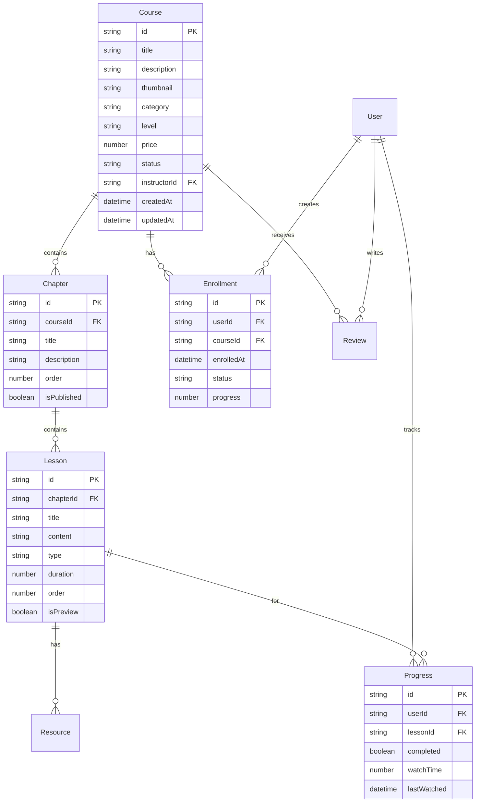

# 第六章：课程管理模块开发

"教育的艺术不在于传授本领，而在于激励、唤醒和鼓舞。" —— 第斯多惠

想象一下，你正在设计一个图书馆的管理系统。你需要考虑书籍的分类、借阅、归还、搜索等功能。而课程管理系统，就像是一个数字化的知识图书馆，但它比传统图书馆更加复杂和动态。

在这里，每一门课程都是一个完整的学习旅程，包含了视频、文档、练习、讨论等多种形式的内容。学习者不仅仅是被动的接受者，更是主动的参与者和创造者。而我们的任务，就是要构建一个既强大又易用的系统，让知识的传递变得更加高效和有趣。

今天，我们将深入探索课程管理模块的设计与实现，从数据模型的设计到用户界面的构建，从内容管理到学习进度跟踪，一步步打造一个现代化的在线学习平台。

## 🎯 本章目标

- 设计完整的课程数据模型
- 实现课程的 CRUD 操作
- 构建课程内容管理系统
- 开发学习进度跟踪功能
- 实现课程搜索和筛选功能

## 📊 课程数据模型设计

### 核心实体关系

在开始编码之前，让我们先理解课程管理系统的核心实体关系：



### TypeScript 类型定义

```typescript
// types/course.ts
export interface Course {
  id: string
  title: string
  description: string
  thumbnail?: string
  category: CourseCategory
  level: CourseLevel
  price: number
  status: CourseStatus
  instructorId: string
  instructor?: User
  chapters: Chapter[]
  enrollmentCount: number
  rating: number
  reviewCount: number
  tags: string[]
  createdAt: string
  updatedAt: string
}

export interface Chapter {
  id: string
  courseId: string
  title: string
  description?: string
  order: number
  isPublished: boolean
  lessons: Lesson[]
  createdAt: string
  updatedAt: string
}

export interface Lesson {
  id: string
  chapterId: string
  title: string
  content: string
  type: LessonType
  duration: number // 秒
  order: number
  isPreview: boolean
  resources: Resource[]
  createdAt: string
  updatedAt: string
}

export interface Resource {
  id: string
  lessonId: string
  title: string
  type: ResourceType
  url: string
  size?: number
  createdAt: string
}

export interface Enrollment {
  id: string
  userId: string
  courseId: string
  course?: Course
  enrolledAt: string
  status: EnrollmentStatus
  progress: number // 0-100
  lastAccessedAt?: string
}

export interface Progress {
  id: string
  userId: string
  lessonId: string
  lesson?: Lesson
  completed: boolean
  watchTime: number // 秒
  lastWatched: string
}

export interface Review {
  id: string
  userId: string
  courseId: string
  user?: User
  rating: number // 1-5
  comment: string
  createdAt: string
  updatedAt: string
}

// 枚举类型
export enum CourseCategory {
  PROGRAMMING = 'programming',
  DESIGN = 'design',
  BUSINESS = 'business',
  MARKETING = 'marketing',
  LANGUAGE = 'language',
  MUSIC = 'music',
  OTHER = 'other'
}

export enum CourseLevel {
  BEGINNER = 'beginner',
  INTERMEDIATE = 'intermediate',
  ADVANCED = 'advanced'
}

export enum CourseStatus {
  DRAFT = 'draft',
  PUBLISHED = 'published',
  ARCHIVED = 'archived'
}

export enum LessonType {
  VIDEO = 'video',
  TEXT = 'text',
  QUIZ = 'quiz',
  ASSIGNMENT = 'assignment'
}

export enum ResourceType {
  PDF = 'pdf',
  VIDEO = 'video',
  AUDIO = 'audio',
  IMAGE = 'image',
  DOCUMENT = 'document',
  LINK = 'link'
}

export enum EnrollmentStatus {
  ACTIVE = 'active',
  COMPLETED = 'completed',
  SUSPENDED = 'suspended'
}
```

## 🏪 课程状态管理

### 课程 Store

```typescript
// composables/useCourse.ts
import { defineStore } from 'pinia'
import type { Course, Chapter, Lesson, Enrollment } from '~/types/course'

interface CourseState {
  courses: Course[]
  currentCourse: Course | null
  enrollments: Enrollment[]
  isLoading: boolean
  error: string | null
  pagination: {
    page: number
    limit: number
    total: number
    totalPages: number
  }
  filters: {
    category?: string
    level?: string
    search?: string
    priceRange?: [number, number]
    rating?: number
  }
}

export const useCourseStore = defineStore('course', {
  state: (): CourseState => ({
    courses: [],
    currentCourse: null,
    enrollments: [],
    isLoading: false,
    error: null,
    pagination: {
      page: 1,
      limit: 12,
      total: 0,
      totalPages: 0
    },
    filters: {}
  }),

  getters: {
    // 获取已发布的课程
    publishedCourses: (state) => 
      state.courses.filter(course => course.status === 'published'),
    
    // 获取用户已注册的课程
    enrolledCourses: (state) => 
      state.enrollments.map(enrollment => enrollment.course).filter(Boolean),
    
    // 根据分类获取课程
    coursesByCategory: (state) => (category: string) =>
      state.courses.filter(course => course.category === category),
    
    // 获取推荐课程
    recommendedCourses: (state) => 
      state.courses
        .filter(course => course.rating >= 4.5)
        .sort((a, b) => b.enrollmentCount - a.enrollmentCount)
        .slice(0, 6),
    
    // 检查用户是否已注册某课程
    isEnrolled: (state) => (courseId: string) =>
      state.enrollments.some(enrollment => 
        enrollment.courseId === courseId && enrollment.status === 'active'
      )
  },

  actions: {
    // 获取课程列表
    async fetchCourses(options?: {
      page?: number
      limit?: number
      category?: string
      level?: string
      search?: string
    }) {
      this.isLoading = true
      this.error = null

      try {
        const params = new URLSearchParams()
        
        if (options?.page) params.append('page', options.page.toString())
        if (options?.limit) params.append('limit', options.limit.toString())
        if (options?.category) params.append('category', options.category)
        if (options?.level) params.append('level', options.level)
        if (options?.search) params.append('search', options.search)

        const { data } = await $fetch<{
          courses: Course[]
          pagination: typeof this.pagination
        }>(`/api/courses?${params}`)

        this.courses = data.courses
        this.pagination = data.pagination

        return { success: true }
      } catch (error: any) {
        this.error = error.data?.message || '获取课程列表失败'
        return { success: false, error: this.error }
      } finally {
        this.isLoading = false
      }
    },

    // 获取单个课程详情
    async fetchCourse(courseId: string) {
      this.isLoading = true
      this.error = null

      try {
        const { data } = await $fetch<{ course: Course }>(`/api/courses/${courseId}`)
        
        this.currentCourse = data.course
        
        // 更新课程列表中的对应项
        const index = this.courses.findIndex(c => c.id === courseId)
        if (index !== -1) {
          this.courses[index] = data.course
        }

        return { success: true, course: data.course }
      } catch (error: any) {
        this.error = error.data?.message || '获取课程详情失败'
        return { success: false, error: this.error }
      } finally {
        this.isLoading = false
      }
    },

    // 创建课程
    async createCourse(courseData: Partial<Course>) {
      this.isLoading = true
      this.error = null

      try {
        const { data } = await $fetch<{ course: Course }>('/api/courses', {
          method: 'POST',
          body: courseData
        })

        this.courses.unshift(data.course)
        this.currentCourse = data.course

        return { success: true, course: data.course }
      } catch (error: any) {
        this.error = error.data?.message || '创建课程失败'
        return { success: false, error: this.error }
      } finally {
        this.isLoading = false
      }
    },

    // 更新课程
    async updateCourse(courseId: string, updates: Partial<Course>) {
      this.isLoading = true
      this.error = null

      try {
        const { data } = await $fetch<{ course: Course }>(`/api/courses/${courseId}`, {
          method: 'PUT',
          body: updates
        })

        // 更新课程列表
        const index = this.courses.findIndex(c => c.id === courseId)
        if (index !== -1) {
          this.courses[index] = data.course
        }

        // 更新当前课程
        if (this.currentCourse?.id === courseId) {
          this.currentCourse = data.course
        }

        return { success: true, course: data.course }
      } catch (error: any) {
        this.error = error.data?.message || '更新课程失败'
        return { success: false, error: this.error }
      } finally {
        this.isLoading = false
      }
    },

    // 删除课程
    async deleteCourse(courseId: string) {
      this.isLoading = true
      this.error = null

      try {
        await $fetch(`/api/courses/${courseId}`, {
          method: 'DELETE'
        })

        // 从列表中移除
        this.courses = this.courses.filter(c => c.id !== courseId)
        
        // 清除当前课程
        if (this.currentCourse?.id === courseId) {
          this.currentCourse = null
        }

        return { success: true }
      } catch (error: any) {
        this.error = error.data?.message || '删除课程失败'
        return { success: false, error: this.error }
      } finally {
        this.isLoading = false
      }
    },

    // 注册课程
    async enrollCourse(courseId: string) {
      this.isLoading = true
      this.error = null

      try {
        const { data } = await $fetch<{ enrollment: Enrollment }>(`/api/courses/${courseId}/enroll`, {
          method: 'POST'
        })

        this.enrollments.push(data.enrollment)

        return { success: true, enrollment: data.enrollment }
      } catch (error: any) {
        this.error = error.data?.message || '注册课程失败'
        return { success: false, error: this.error }
      } finally {
        this.isLoading = false
      }
    },

    // 获取用户的注册课程
    async fetchEnrollments() {
      this.isLoading = true
      this.error = null

      try {
        const { data } = await $fetch<{ enrollments: Enrollment[] }>('/api/enrollments')
        
        this.enrollments = data.enrollments

        return { success: true }
      } catch (error: any) {
        this.error = error.data?.message || '获取注册课程失败'
        return { success: false, error: this.error }
      } finally {
        this.isLoading = false
      }
    },

    // 设置筛选条件
    setFilters(filters: Partial<CourseState['filters']>) {
      this.filters = { ...this.filters, ...filters }
    },

    // 清除筛选条件
    clearFilters() {
      this.filters = {}
    },

    // 重置状态
    reset() {
      this.courses = []
      this.currentCourse = null
      this.enrollments = []
      this.error = null
      this.pagination = {
        page: 1,
        limit: 12,
        total: 0,
        totalPages: 0
      }
      this.filters = {}
    }
  }
})

// 导出便捷的组合式函数
export const useCourse = () => {
  const store = useCourseStore()
  
  return {
    // 状态
    courses: readonly(toRef(store, 'courses')),
    currentCourse: readonly(toRef(store, 'currentCourse')),
    enrollments: readonly(toRef(store, 'enrollments')),
    isLoading: readonly(toRef(store, 'isLoading')),
    error: readonly(toRef(store, 'error')),
    pagination: readonly(toRef(store, 'pagination')),
    filters: readonly(toRef(store, 'filters')),
    
    // 计算属性
    publishedCourses: computed(() => store.publishedCourses),
    enrolledCourses: computed(() => store.enrolledCourses),
    recommendedCourses: computed(() => store.recommendedCourses),
    
    // 方法
    fetchCourses: store.fetchCourses,
    fetchCourse: store.fetchCourse,
    createCourse: store.createCourse,
    updateCourse: store.updateCourse,
    deleteCourse: store.deleteCourse,
    enrollCourse: store.enrollCourse,
    fetchEnrollments: store.fetchEnrollments,
    setFilters: store.setFilters,
    clearFilters: store.clearFilters,
    isEnrolled: store.isEnrolled,
    coursesByCategory: store.coursesByCategory
  }
}
```

## 📋 课程列表组件

### 课程卡片组件

```vue
<!-- components/courses/CourseCard.vue -->
<template>
  <Card class="group overflow-hidden transition-all duration-300 hover:shadow-lg">
    <!-- 课程缩略图 -->
    <div class="relative aspect-video overflow-hidden">
      
      
      <!-- 课程级别标签 -->
      <Badge
        :variant="getLevelVariant(course.level)"
        class="absolute top-2 left-2"
      >
        {{ getLevelText(course.level) }}
      </Badge>
      
      <!-- 价格标签 -->
      <div class="absolute top-2 right-2">
        <Badge v-if="course.price === 0" variant="secondary">
          免费
        </Badge>
        <Badge v-else variant="default" class="bg-green-600">
          ¥{{ course.price }}
        </Badge>
      </div>
      
      <!-- 播放按钮 -->
      <div class="absolute inset-0 flex items-center justify-center opacity-0 transition-opacity duration-300 group-hover:opacity-100">
        <Button size="icon" variant="secondary" class="rounded-full">
          <Play class="h-4 w-4" />
        </Button>
      </div>
    </div>

    <CardContent class="p-4">
      <!-- 课程分类 -->
      <div class="mb-2">
        <Badge variant="outline" class="text-xs">
          {{ getCategoryText(course.category) }}
        </Badge>
      </div>

      <!-- 课程标题 -->
      <h3 class="mb-2 line-clamp-2 text-lg font-semibold leading-tight">
        {{ course.title }}
      </h3>

      <!-- 课程描述 -->
      <p class="mb-3 line-clamp-2 text-sm text-muted-foreground">
        {{ course.description }}
      </p>

      <!-- 讲师信息 -->
      <div class="mb-3 flex items-center gap-2">
        <Avatar class="h-6 w-6">
          <AvatarImage :src="course.instructor?.avatar" />
          <AvatarFallback>
            {{ course.instructor?.name?.charAt(0) }}
          </AvatarFallback>
        </Avatar>
        <span class="text-sm text-muted-foreground">
          {{ course.instructor?.name }}
        </span>
      </div>

      <!-- 课程统计 -->
      <div class="mb-4 flex items-center justify-between text-sm text-muted-foreground">
        <div class="flex items-center gap-4">
          <!-- 评分 -->
          <div class="flex items-center gap-1">
            <Star class="h-4 w-4 fill-yellow-400 text-yellow-400" />
            <span>{{ course.rating.toFixed(1) }}</span>
            <span>({{ course.reviewCount }})</span>
          </div>
          
          <!-- 学员数量 -->
          <div class="flex items-center gap-1">
            <Users class="h-4 w-4" />
            <span>{{ formatNumber(course.enrollmentCount) }}</span>
          </div>
        </div>
      </div>

      <!-- 操作按钮 -->
      <div class="flex gap-2">
        <Button
          v-if="!isEnrolled(course.id)"
          @click="handleEnroll"
          class="flex-1"
          :disabled="enrolling"
        >
          <Loader2 v-if="enrolling" class="mr-2 h-4 w-4 animate-spin" />
          {{ course.price === 0 ? '免费学习' : '立即购买' }}
        </Button>
        
        <Button
          v-else
          @click="handleContinue"
          class="flex-1"
        >
          继续学习
        </Button>
        
        <Button
          variant="outline"
          size="icon"
          @click="handleToggleFavorite"
          :class="{ 'text-red-500': isFavorited }"
        >
          <Heart :class="{ 'fill-current': isFavorited }" class="h-4 w-4" />
        </Button>
      </div>
    </CardContent>
  </Card>
</template>

<script setup lang="ts">
import { Play, Star, Users, Heart, Loader2 } from 'lucide-vue-next'
import { Card, CardContent } from '@/components/ui/card'
import { Button } from '@/components/ui/button'
import { Badge } from '@/components/ui/badge'
import { Avatar, AvatarImage, AvatarFallback } from '@/components/ui/avatar'
import type { Course } from '~/types/course'
import { useCourse } from '~/composables/useCourse'

interface Props {
  course: Course
}

const props = defineProps<Props>()

// 状态管理
const { enrollCourse, isEnrolled } = useCourse()
const enrolling = ref(false)
const isFavorited = ref(false) // 这里应该从用户偏好中获取

// 注册课程
async function handleEnroll() {
  if (props.course.price > 0) {
    // 如果是付费课程，跳转到支付页面
    await navigateTo(`/courses/${props.course.id}/checkout`)
  } else {
    // 免费课程直接注册
    enrolling.value = true
    const result = await enrollCourse(props.course.id)
    enrolling.value = false
    
    if (result.success) {
      await navigateTo(`/courses/${props.course.id}`)
    }
  }
}

// 继续学习
async function handleContinue() {
  await navigateTo(`/courses/${props.course.id}`)
}

// 切换收藏状态
function handleToggleFavorite() {
  isFavorited.value = !isFavorited.value
  // 这里应该调用 API 更新用户偏好
}

// 获取级别变体
function getLevelVariant(level: string) {
  const variants = {
    beginner: 'secondary',
    intermediate: 'default',
    advanced: 'destructive'
  }
  return variants[level] || 'secondary'
}

// 获取级别文本
function getLevelText(level: string) {
  const texts = {
    beginner: '初级',
    intermediate: '中级',
    advanced: '高级'
  }
  return texts[level] || '未知'
}

// 获取分类文本
function getCategoryText(category: string) {
  const texts = {
    programming: '编程开发',
    design: '设计创意',
    business: '商业管理',
    marketing: '市场营销',
    language: '语言学习',
    music: '音乐艺术',
    other: '其他'
  }
  return texts[category] || '其他'
}

// 格式化数字
function formatNumber(num: number) {
  if (num >= 1000) {
    return (num / 1000).toFixed(1) + 'k'
  }
  return num.toString()
}
</script>

<style scoped>
.line-clamp-2 {
  display: -webkit-box;
  -webkit-line-clamp: 2;
  -webkit-box-orient: vertical;
  overflow: hidden;
}
</style>
```

### 课程列表组件

```vue
<!-- components/courses/CourseList.vue -->
<template>
  <div class="space-y-6">
    <!-- 筛选和搜索 -->
    <div class="flex flex-col gap-4 lg:flex-row lg:items-center lg:justify-between">
      <!-- 搜索框 -->
      <div class="relative flex-1 max-w-md">
        <Search class="absolute left-3 top-1/2 h-4 w-4 -translate-y-1/2 text-muted-foreground" />
        <Input
          v-model="searchQuery"
          placeholder="搜索课程..."
          class="pl-10"
          @input="handleSearch"
        />
      </div>

      <!-- 筛选器 -->
      <div class="flex flex-wrap gap-2">
        <!-- 分类筛选 -->
        <Select v-model="selectedCategory" @update:model-value="handleCategoryChange">
          <SelectTrigger class="w-32">
            <SelectValue placeholder="分类" />
          </SelectTrigger>
          <SelectContent>
            <SelectItem value="">全部分类</SelectItem>
            <SelectItem value="programming">编程开发</SelectItem>
            <SelectItem value="design">设计创意</SelectItem>
            <SelectItem value="business">商业管理</SelectItem>
            <SelectItem value="marketing">市场营销</SelectItem>
            <SelectItem value="language">语言学习</SelectItem>
            <SelectItem value="music">音乐艺术</SelectItem>
          </SelectContent>
        </Select>

        <!-- 级别筛选 -->
        <Select v-model="selectedLevel" @update:model-value="handleLevelChange">
          <SelectTrigger class="w-32">
            <SelectValue placeholder="级别" />
          </SelectTrigger>
          <SelectContent>
            <SelectItem value="">全部级别</SelectItem>
            <SelectItem value="beginner">初级</SelectItem>
            <SelectItem value="intermediate">中级</SelectItem>
            <SelectItem value="advanced">高级</SelectItem>
          </SelectContent>
        </Select>

        <!-- 排序 -->
        <Select v-model="sortBy" @update:model-value="handleSortChange">
          <SelectTrigger class="w-32">
            <SelectValue placeholder="排序" />
          </SelectTrigger>
          <SelectContent>
            <SelectItem value="latest">最新发布</SelectItem>
            <SelectItem value="popular">最受欢迎</SelectItem>
            <SelectItem value="rating">评分最高</SelectItem>
            <SelectItem value="price-low">价格从低到高</SelectItem>
            <SelectItem value="price-high">价格从高到低</SelectItem>
          </SelectContent>
        </Select>

        <!-- 清除筛选 -->
        <Button
          v-if="hasActiveFilters"
          variant="outline"
          @click="clearAllFilters"
        >
          <X class="mr-2 h-4 w-4" />
          清除筛选
        </Button>
      </div>
    </div>

    <!-- 活跃筛选标签 -->
    <div v-if="hasActiveFilters" class="flex flex-wrap gap-2">
      <Badge
        v-if="selectedCategory"
        variant="secondary"
        class="cursor-pointer"
        @click="selectedCategory = ''"
      >
        {{ getCategoryText(selectedCategory) }}
        <X class="ml-1 h-3 w-3" />
      </Badge>
      
      <Badge
        v-if="selectedLevel"
        variant="secondary"
        class="cursor-pointer"
        @click="selectedLevel = ''"
      >
        {{ getLevelText(selectedLevel) }}
        <X class="ml-1 h-3 w-3" />
      </Badge>
      
      <Badge
        v-if="searchQuery"
        variant="secondary"
        class="cursor-pointer"
        @click="searchQuery = ''"
      >
        "{{ searchQuery }}"
        <X class="ml-1 h-3 w-3" />
      </Badge>
    </div>

    <!-- 结果统计 -->
    <div class="flex items-center justify-between">
      <p class="text-sm text-muted-foreground">
        找到 {{ pagination.total }} 门课程
      </p>
      
      <!-- 视图切换 -->
      <div class="flex items-center gap-2">
        <Button
          variant="outline"
          size="icon"
          :class="{ 'bg-muted': viewMode === 'grid' }"
          @click="viewMode = 'grid'"
        >
          <Grid3X3 class="h-4 w-4" />
        </Button>
        <Button
          variant="outline"
          size="icon"
          :class="{ 'bg-muted': viewMode === 'list' }"
          @click="viewMode = 'list'"
        >
          <List class="h-4 w-4" />
        </Button>
      </div>
    </div>

    <!-- 加载状态 -->
    <div v-if="isLoading" class="grid gap-6 md:grid-cols-2 lg:grid-cols-3">
      <CourseSkeleton v-for="i in 6" :key="i" />
    </div>

    <!-- 课程网格 -->
    <div
      v-else-if="courses.length > 0"
      :class="[
        'grid gap-6',
        viewMode === 'grid' 
          ? 'md:grid-cols-2 lg:grid-cols-3 xl:grid-cols-4' 
          : 'grid-cols-1'
      ]"
    >
      <CourseCard
        v-for="course in courses"
        :key="course.id"
        :course="course"
        :class="viewMode === 'list' ? 'max-w-none' : ''"
      />
    </div>

    <!-- 空状态 -->
    <div v-else class="flex flex-col items-center justify-center py-12">
      <div class="mb-4 rounded-full bg-muted p-4">
        <BookOpen class="h-8 w-8 text-muted-foreground" />
      </div>
      <h3 class="mb-2 text-lg font-semibold">没有找到课程</h3>
      <p class="mb-4 text-center text-muted-foreground">
        尝试调整筛选条件或搜索其他关键词
      </p>
      <Button @click="clearAllFilters">
        清除所有筛选条件
      </Button>
    </div>

    <!-- 分页 -->
    <div v-if="pagination.totalPages > 1" class="flex justify-center">
      <Pagination
        :current-page="pagination.page"
        :total-pages="pagination.totalPages"
        @page-change="handlePageChange"
      />
    </div>
  </div>
</template>

<script setup lang="ts">
import { Search, X, Grid3X3, List, BookOpen } from 'lucide-vue-next'
import { Input } from '@/components/ui/input'
import { Button } from '@/components/ui/button'
import { Badge } from '@/components/ui/badge'
import {
  Select,
  SelectContent,
  SelectItem,
  SelectTrigger,
  SelectValue,
} from '@/components/ui/select'
import CourseCard from './CourseCard.vue'
import CourseSkeleton from './CourseSkeleton.vue'
import Pagination from '@/components/ui/pagination.vue'
import { useCourse } from '~/composables/useCourse'
import { useDebounceFn } from '@vueuse/core'

// 状态管理
const {
  courses,
  isLoading,
  pagination,
  fetchCourses,
  setFilters,
  clearFilters
} = useCourse()

// 筛选状态
const searchQuery = ref('')
const selectedCategory = ref('')
const selectedLevel = ref('')
const sortBy = ref('latest')
const viewMode = ref<'grid' | 'list'>('grid')

// 计算属性
const hasActiveFilters = computed(() => 
  searchQuery.value || selectedCategory.value || selectedLevel.value
)

// 防抖搜索
const handleSearch = useDebounceFn(() => {
  fetchCoursesWithFilters()
}, 300)

// 筛选处理
function handleCategoryChange() {
  fetchCoursesWithFilters()
}

function handleLevelChange() {
  fetchCoursesWithFilters()
}

function handleSortChange() {
  fetchCoursesWithFilters()
}

// 清除所有筛选
function clearAllFilters() {
  searchQuery.value = ''
  selectedCategory.value = ''
  selectedLevel.value = ''
  sortBy.value = 'latest'
  clearFilters()
  fetchCoursesWithFilters()
}

// 分页处理
function handlePageChange(page: number) {
  fetchCoursesWithFilters(page)
}

// 获取课程数据
async function fetchCoursesWithFilters(page = 1) {
  const filters = {
    page,
    search: searchQuery.value || undefined,
    category: selectedCategory.value || undefined,
    level: selectedLevel.value || undefined,
    sort: sortBy.value
  }

  setFilters(filters)
  await fetchCourses(filters)
}

// 工具函数
function getCategoryText(category: string) {
  const texts = {
    programming: '编程开发',
    design: '设计创意',
    business: '商业管理',
    marketing: '市场营销',
    language: '语言学习',
    music: '音乐艺术'
  }
  return texts[category] || category
}

function getLevelText(level: string) {
  const texts = {
    beginner: '初级',
    intermediate: '中级',
    advanced: '高级'
  }
  return texts[level] || level
}

// 初始化
onMounted(() => {
  fetchCoursesWithFilters()
})
</script>
```

## 🧪 实践练习

1. **实现课程详情页面**
   - 显示完整的课程信息
   - 章节和课时列表
   - 评价和评论系统

2. **添加课程创建功能**
   - 多步骤表单
   - 文件上传处理
   - 内容编辑器集成

3. **实现学习进度跟踪**
   - 课时完成状态
   - 学习时长统计
   - 进度可视化

## 💭 思考题

1. **如何设计一个可扩展的课程内容结构？**
   - 支持多种媒体类型
   - 灵活的章节组织
   - 版本控制和历史记录

2. **课程搜索和推荐算法如何优化？**
   - 全文搜索实现
   - 个性化推荐策略
   - 搜索结果排序优化

3. **如何处理大量课程数据的性能问题？**
   - 虚拟滚动实现
   - 数据分页策略
   - 缓存机制设计

## 🎉 小结

通过这一章的学习，我们构建了一个功能完整的课程管理系统。从数据模型的设计到用户界面的实现，从状态管理到用户交互，我们掌握了构建现代化学习平台的核心技能。

我们学到了：
- ✅ 复杂数据模型的设计和类型定义
- ✅ 状态管理的最佳实践
- ✅ 组件化开发和复用
- ✅ 用户体验优化技巧
- ✅ 搜索和筛选功能的实现

一个好的课程管理系统就像是一个精心设计的图书馆，它不仅要有丰富的内容，更要有便捷的查找和学习方式。在下一章中，我们将深入探索富文本编辑器的集成，让内容创作变得更加强大和灵活。

---

**下一章预告：** 《富文本编辑器集成》- 我们将学习如何集成和定制 Tiptap 编辑器，实现强大的内容创作功能，包括多媒体插入、协作编辑和内容导出等高级特性。